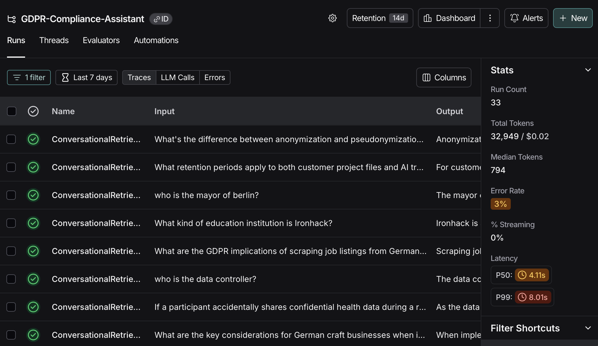
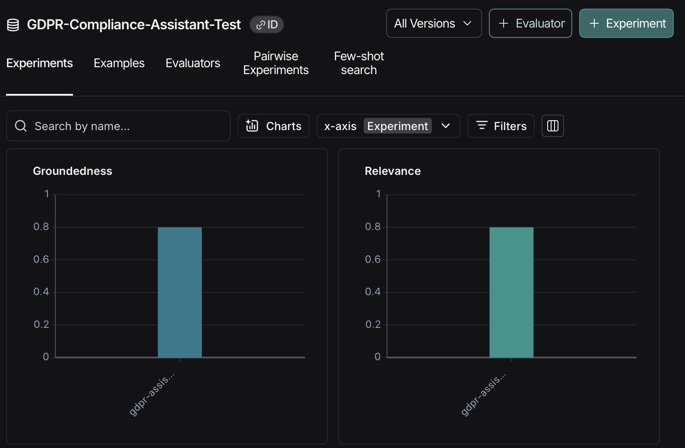

Here's your updated README.md with all the new sections added:

# GDPR Compliance Assistant for Craftspeople


A multilingual Retrieval-Augmented Generation (RAG) system that helps craftspeople and small businesses understand GDPR compliance requirements through natural language conversations.

## 📖 Project Overview

This project creates an intelligent assistant that can answer data protection questions specifically tailored for craftspeople and small businesses. The system uses German GDPR guidelines and can handle questions in both English and German.

### Data Sources

**Primary Datasets**:

1. **ZDH Data Protection Guide for Crafts Businesses** ([Download PDF](https://www.zdh.de/ueber-uns/fachbereich-organisation-und-recht/datenschutz/datenschutz-fuer-handwerksbetriebe/))
   - **Description**: Comprehensive GDPR guidelines specifically designed for craftspeople and small businesses in Germany. Covers practical implementation of data protection rules with sector-specific examples and recommendations.
   - **Author**: Dr. Markus Peifer, Head of Organization and Law Department, ZDH (Zentralverband des Deutschen Handwerks - Central Association of German Skilled Trades)

2. **BITKOM AI & Data Protection - Practical Guide 2.0** ([Download PDF](https://www.bitkom.org/Bitkom/Publikationen/KI-Datenschutz-Praxisleitfaden))
   - **Description**: The second edition of the "AI & Data Protection" practical guide serves as a comprehensive reference for companies and organizations that want to use and implement AI technologies in compliance with data protection regulations. It provides practical instructions, legal foundations, and concrete tools to ensure that the processing of personal data is in line with GDPR and other relevant regulations.
   - **Key Features**: Contains definitions, instructions, and practice-oriented checklists. Specifically addresses data protection requirements and ethical questions when using AI systems. Includes detailed examples and implementation tips for data protection-compliant AI implementation.
   - **Organization**: BITKOM is Germany's most important digital association and largest European think tank for digital topics, with over 2,200 member companies including SMEs, tech startups, and DAX corporations.

**Key Topics Covered**:
- Basic data protection principles for small businesses
- Customer data handling requirements
- Employee data management
- Data retention periods
- Marketing and consent rules
- Data breach procedures
- AI-specific data protection requirements
- Ethical AI implementation
- Practical implementation guidance

## 🚀 Project Roadmap

### Phase 1: Proof of Concept (POC)
- **POC 1** ✅: Ask questions in German, receive answers in German
- **POC 2** ✅: Ask questions in English or German, receive answers in the same language

### Phase 2: Minimum Viable Product (MVP)
- **MVP 1** ✅: **Web interface with chatbot functionality** - Live at: ([`Streamlit Cloud`](https://multilingual-gdpr-rag-germany.streamlit.app))
- **MVP 2** ✅: **Enhanced knowledge base with AI & Data Protection guidelines** - BITKOM guide integrated

### Current Status: Production Live
- **✅ LangSmith Integration**: Real-time tracing and monitoring
- **✅ Performance Evaluation**: Automated testing and metrics
- **✅ Enhanced UI**: Improved user experience with expandable sections

## 🛠️ Technical Stack

- **Framework**: LangChain
- **Vector Database**: Pinecone
- **Embeddings**: "text-embedding-3-small" Sentence Transformers (multilingual)
- **Language Model**: OpenAI "gpt-3.5-turbo"
- **Web Interface**: Streamlit
- **Monitoring**: LangSmith for tracing and evaluation
- **Language Support**: Multilingual: tested in German & English

## 📁 Project Structure

```
gdpr_compliance_assistant/
├── notebooks/                          # Jupyter notebooks for development
│   ├── 01_text_pdf_processing_document-2.ipynb         # Process PDF → chunks
│   ├── 02_pinecone_upload.ipynb        # Upload to Pinecone (run once)
│   ├── 03a_rag_chain.ipynb              # Build RAG (uses existing index)
│   ├── 03b_rag_agent_tests.ipynb        # Experiments with Agent & RAG
│   ├── 04_pinecone_upload_new_documents.ipynb  # Modular PDF processing
│   └── 05_evaluate_gdpr_chatbot.ipynb  # LangSmith evaluation
├── data/
│   ├── raw/ # Original PDF documents
│   └── processed/ # Processed chunks and vector database
├── pages/                              # Streamlit app pages
│   ├── 1_🛡️_GDPR_AI_Compliance_Assistant.py  # Main chatbot interface
│   └── 2_About_the_app.py              # About page
├── home_app.py                         # Streamlit app launcher
├── backend.py                          # Core RAG logic and LangSmith setup
├── utils.py                            # Utility functions
├── docs/                               # Documentation, sample chats, evaluation results and test questions
│   └── german_experiment_results.csv   # Evaluation results
├── img/                                # Screenshots and images of LangSmith monitorin
├── src/                                # Source helper functions for the notebooks
└── requirements.txt                    # Dependencies
```

## 🎯 Key Features

- **Multilingual Support**: Questions and answers tested mainly in German and English
- **Context-Aware Answers**: Based on official craftspeople and AI guidelines
- **Live Web Interface**: Accessible via Streamlit deployment
- **Dual Knowledge Base**: Combines traditional GDPR and AI-specific data protection
- **Conversation Memory**: Maintains context across multiple questions
- **Source Transparency**: Shows which documents were used for answers

## 📊 Data Processing

The system processes PDF documents through:
1. **Text Extraction**: Automatic extraction from German PDFs
2. **Intelligent Chunking**: Semantic splitting with meaningful metadata
3. **Multilingual Embeddings**: Vector representations for semantic search
4. **RAG Pipeline**: Combines retrieval with generative AI

##  Streamlit App Structure

The app features a modern multi-page structure:

### App Architecture:
- **`home_app.py`** - Main launcher that initializes the app
- **`pages/1_🛡️_GDPR_AI_Compliance_Assistant.py`** - Primary chatbot interface
- **`pages/2_About_the_app.py`** - Information and documentation page
- **`backend.py`** - Core RAG logic with LangSmith integration

### Key Components:
- **Sidebar Navigation**: Easy switching between chat and about pages
- **Expandable Welcome Section**: Guided introduction for new users
- **Real-time Chat Interface**: Interactive Q&A with source citations
- **Responsive Design**: Optimized for both desktop and mobile

**Live Demo**: [multilingual-gdpr-rag-germany.streamlit.app](https://multilingual-gdpr-rag-germany.streamlit.app)

[](https://multilingual-gdpr-rag-germany.streamlit.app)

## 🔍 LangSmith Integration & Monitoring

### Real-time Tracing
The app is fully integrated with LangSmith for comprehensive monitoring:

- **Automatic Trace Collection**: Every user interaction is logged
- **Performance Metrics**: Response times, token usage, and quality metrics
- **EU Data Residency**: All data processed through EU endpoints for compliance
- **Dashboard Analytics**: Real-time insights into app usage and performance

 *LangSmith monitoring dashboard showing real-time traces and performance metrics*

### Configuration:
```python
# LangSmith setup in backend.py
os.environ["LANGSMITH_TRACING"] = "true"
os.environ["LANGSMITH_API_KEY"] = "your_api_key"
os.environ["LANGSMITH_ENDPOINT"] = "https://eu.api.smith.langchain.com"
os.environ["LANGSMITH_PROJECT"] = "GDPR-Compliance-Assistant"
```

## 📈 Evaluation & Performance

### Automated Testing with LangSmith
The chatbot has been evaluated using LangSmith's evaluation framework:

- **Test Dataset**: 10 English / German questions covering various GDPR topics
- **Evaluation Metrics**: 
  - **Groundedness**: 0.8 (Answers based on source documents)
  - **Relevance**: 0.8 (Answers directly address questions)
- **Results File**: `docs/german_experiment_results.csv`

### Evaluation Methodology:
1. **Dataset Creation**: Curated English / German test questions with expected answers
2. **Automated Testing**: LangSmith runs the chatbot against all test cases
3. **LLM-as-Judge**: GPT-4 evaluates answer quality and accuracy
4. **Performance Tracking**: Continuous monitoring of improvement over time

 *LangSmith evaluation dashboard showing Experiments that measure the quality of your applications.*

## 🧪 Testing & Examples

### Sample Questions & Test Cases
The project includes comprehensive test materials to evaluate chatbot performance:

- **`docs/sample_questions_1_test_questions.md`** - Diverse test questions covering:
  - Basic GDPR principles and compliance
  - AI-specific data protection requirements  
  - Multilingual capabilities (German/English)
  - Edge cases and complex scenarios

- **`docs/sample_questions_2_memory-test.md`** - Conversation sequences testing:
  - Follow-up question understanding
  - Context retention across multiple exchanges
  - Progressive topic exploration

### Example Chat Conversations
Real conversation examples demonstrating the chatbot's capabilities:

- **`docs/sample_chats/Bakery_20251017_090204.txt`** - Fundamental GDPR compliance queries
- **`docs/sample_chats/chatbot-wrong-information_20251017_084723.txt`** - AI-specific data protection discussions
- **`docs/sample_chats/IT_Violazione_Dati_IA_20251016_095600.txt`** - Chat in Italian about data protection violations

These test materials serve as both quality assurance tools and demonstration of the chatbot's knowledge range and conversational abilities.

--------

## 🚀 Future Improvements

### Planned Enhancements:

- **Human Feedback Integration**: 👍/👎 rating system connected to LangSmith for continuous improvement
- **LangGraph Migration**: Update to current LangChain code system for better agent orchestration
- **Enhanced Tooling**: Additional tools for document analysis and compliance checking
- **Model Toggle**: Switch between different LLMs (OpenAI/Hugging Face) and embedding models
- **Advanced Analytics**: Deeper insights into user behavior and common question patterns

## 🤝 Contributing

This project is developed as part of a data science learning journey. Contributions and suggestions are welcome!

## ⚖️ Disclaimer

This assistant provides general guidance based on official documentation but does not constitute legal advice. For specific legal questions, consult with qualified legal professionals or local trade organizations (Handwerkskammern, Innungen, Fachverbände).

## 📄 License

This project is for educational purposes. The source documents are property of their respective organizations (ZDH, BITKOM).

## 📞 Contact

For questions about this project or suggestions for improvement, please open an issue in the repository.

---

**Built with ❤️ for craftspeople and other businesses navigating data protection regulations in Germany**


-----
